# Opa, meu nome é João Pedro Alves

Desenvolvedor Full-Stack e atualmente estudante do 8º e último período de Bacharelado em Ciência da Computação no IFSULDEMINAS - Campus Muzambinho, instituição onde também me formei em Técnico em Informática (2020-2023).

Atualmente, estou focado no desenvolvimento do meu TCC, onde realizo uma análise comparativa e comportamental entre modelos de visão computacional (CNN e ViT) para a identificação de lavouras de café no Sul de Minas. Em paralelo, atuo como Desenvolvedor Back-end (bolsista) no projeto de desenvolvimento do Novo Portal Institucional do IFSULDEMINAS.

## 🛠️ Tecnologias e Ferramentas

**Back-end:**

**Front-end:**

**Ferramentas e Outras Tecnologias:**

## 💼 Experiência

- **IFSULDEMINAS (Reitoria):** Desenvolvedor Back-end (bolsista) no projeto de desenvolvimento do novo Portal Institucional (Dez/2025 - Presente).
- **AIDA Business Intelligence:** Ex-Desenvolvedor Full-Stack Júnior (Out/2025 - Mar/2026).
- **IFSULDEMINAS - Campus Muzambinho:** Desenvolvedor Full-Stack (Bolsista CNPq - Iniciação Científica) do projeto Campus Inteligente (Ago/2023 - Ago/2024).

## 📊 Estatísticas do GitHub

### 📈 Estatísticas Gerais e Linguagens Mais Utilizadas

  
  

### 🔥 Sequência de Commits

  

### 📊 Gráfico de Commits 2D

  

## 📫 Como me encontrar

